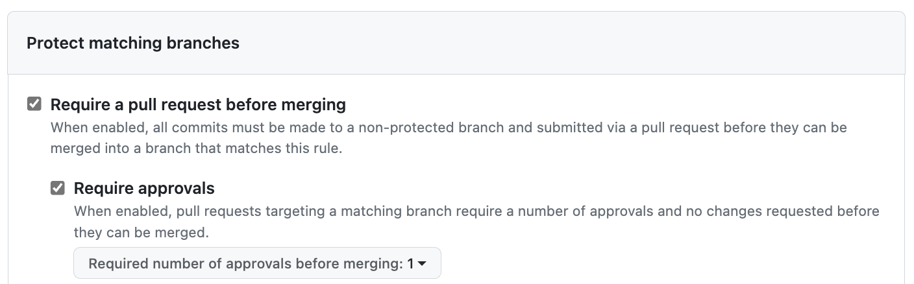

# Introduction 

This activity has the goal of teaching basic and more advanced git and GitHub features. Do Part 1 by yourself and work with a partner on Part 2. 

# Part 1: Git Basics

Start by creating a folder called **apollo**, switch to it, and initialize a git (local) repository. 

```
mkdir apollo
cd apollo
git init
```

"git init" creates a new git repository.  Verify that a (hidden) file called **.git** was created. 

```
ls .git
```

Next, create a Python script named **doit.py** with the following content: 

```
def isEven(number): 
    return number % 2 == 0

if __name__ == "__main__":
    if isEven(10):
        print('Even!')
    else:
        print('Odd!')
```

Suppose that we want to add **doit.py** to git's version control system under **apollo**. Do the following:

```
git add doit.py
```

Now the **doit.py** script is "staged" (i.e., ready to be part of the next version). Run the following command to get a list of "staged" files. 

```
git diff --name-only --cached
```

Let's now run the following command to create a new version of the repository with the newly "staged" **doit.py** file. 

```
git commit -m "creation of doit.py" 
```

Let's tag this version as "v0.1". Remember: tagging commits is optional. 

```
git tag v0.1
```

Use the following to see a summary of all that was done so far.  

```
git log
```

You can also get a summary using: 

```
git log --oneline
```

Check that at this point no files are currently "staged". 

```
git diff --name-only --cached
```

Proceed by making a change on **doit.py**. 

```
def isEven(number): 
    return number % 2 == 0

def isOdd(number): 
    return not isEven(number)

if __name__ == "__main__":
    if isEven(10):
        print('Even!')
    else:
        print('Odd!')
```

Let's stage **doit.py** again by running add followed by a commit and tag. 

```
git add doit.py
git commit -m "updates on doit.py"
git tag v0.2
```

If you run "git log --oneline" you should see that "head" points to version "v0.2" and before that we had version "v0.1". 

Now let's learn how to go back to a previous version using the "checkout" command passing the version name that we want. 

```
git checkout "v0.1"
```

If you take a peek at **doit.py** now you should see the original version of the script. 

Go back to the current version "v0.2" also using checkout. 

```
git checkout "v0.2"
```

Make sure that **doit.py** now is the version with the latest updates. 

Now let's understand all about "branching".  Use the following to learn the name of your current branch. 

```
git branch
```

"main" is the default branch name. We use branching whenever we want to experiment something before deciding to incorporate it into the new version of the repository. Let's create a new branch called "testing". 

```
git branch testing 
```

That command only creates the "testing" branch but it doesn't change the current branch to it. You need to run git's "checkout" command for that. 

```
git checkout testing
```

In the future you can run both commands in one step by using: 

```
git checkout -b testing
```

Now modify **doit.py** like the following. 

```
from random import randrange

def isEven(number): 
    return number % 2 == 0

def isOdd(number): 
    return not isEven(number)

if __name__ == "__main__":
    number = randrange(100)
    if isEven(number):
        print(f'{number} is even!')
    else:
        print(f'{number} is odd!')
```

Add and commit the changes to **doit.py**. 

```
git add doit.py
git commit -m "+updates to doit.py"
```

Next, let's go back to the "main" branch. 

```
git checkout main
```

Finally, let's merge the "testing" branch to the "main" branch, tagging this commit as "v0.3". 

```
git merge testing
git tag "v0.3"
```

Run "git log --oneline" again to visualize all of the branches done so far. 

As an exercise, change the current version to "v0.1" and check the state of **doit.py**. Do the same for version "v0.2" and then go back to "v0.3". 

# Part 2: Working Cooperatively

In this part your will work with a partner.  From now on partners will be referred to as PA and PB. PA should create a remote repository on GitHub called **hera**. PA should then clone the newly created repository. 

```
git clone https://github.com/<account>/hera
cd hera
```

Next, PA should go to the repository Settings - Access - Collaborators and add PB. Have PB accept the invitation to collaborate on **hera**. 

To start the "main" branch, PA needs to run a first commit. Create a README.md file with the following text. 

```
# Project HERA

This is project **hera**!
```

Add the file to the repository and commit the change, also updating the remote. 

```
git add README.md
git commit -m "main branch kick-off"
git push origin main
```

PA should then create and commit a "dev" branch for the unstable versions.  The "main" branch (default one) will be reserved for the stable versions of the development. 

```
git branch dev
git checkout dev
git commit --allow-empty -m "Creation of the dev branch"
git push origin dev
```

"origin" refers to the remote repository and "dev" is the name of the branch in the remote.  At this point, if you go to GitHub you should be able to see the 2 branches: "main" and "dev". 

Next, PA needs to protect the "main" branch on GitHub. Use the following settings. 



Now let's simulate a "sprint" development cycle.  PA and PB will simulatenously work on features "feature_a" and "feature_b", respectively.

PA should do: 

```
git branch feature_a
git checkout feature_a
```

Next, PA should add the file **src/feature_a.py** with the following content:  

```
print('This is the amazing feature A!')
print('Have a nice day!')
```

Next, have PA add and commit to "feature_a" branch followed by a merge to the local "dev". After that, PA should wait and make sure PB also worked on their feature. 

```
git add src/feature_a.py
git commit -m "feature a updates"
git checkout dev
git merge feature_a
```

Have PB clone the repository, and create their local "dev" and "feature_b" branches. 

```
git clone https://github.com/<account>/hera
git branch dev
git checkout dev
git branch feature_b
git checkout feature_b
```

Have PB add the file **src/feature_b.py** with the following content: 

```
print('This is the amazing feature B!')
print('Have a nice day!')
```

Have PB add and commit to "feature_b" branch, followed by a merge to local "dev". 

```
git add src/feature_b.py
git commit -m "feature b updates"
git checkout dev
git merge feature_b
```

Now that PB had time to catch up, let's have PA perform a local merge with the remote followed by a remote update. PA has no way to tell whether its local version of "dev" diverged from the remote or not. Therefore, before pushing its updates to the remote PA should first merge its version with the remote followed by a remote update. 

```
git config pull.rebase false
git pull origin dev
git push origin dev
```

At this point PB has a divergent version of the remote "dev" branch. PB now has 2 ways of solving the divergence: merging or rebasing. Let's have PB perform a rebasing since PA already showed how to do a merge. Remember: rebasing is destructive and PB will loose some of its commit history, which at this point should have 2 commits: the main branch kick-off and the feature b updates. PB should now do the following: 

```
git config pull.rebase true
git pull origin dev
git push origin dev
```

Now if PB checks its commit history using "git log" it should see: "main branch kick-off", "creation of the dev branch", "feature a updates", and "feature b updates". 

# Pull Request

If you refresh the repository page on GitHub for project **hera** you will see that the "main" branch is still in its original state: with only the README.md file and no feature updates. If you switch to "dev" GitHub will show the "Compare & pull request" button. Click on that button, write the message "features a and b", and confirm the pull request. Because the "main" branch is protected, the pull request needs to be approved by at least one collaborator. Since PA initiated the request, only PB can approve it. Have PB perform a code review followed by an approval of the pull request (merge from "dev" to "main"). 
