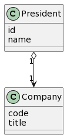
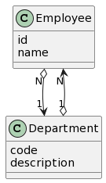
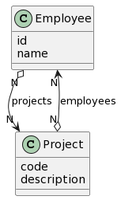

# Introduction

This activity's goal is to help you understand the various types of relationships that you can configure in SQLAlchemy. 

# Setup

Install Python's SQLAlchemy's package in your virtual environment. 

```
pip3 install sqlalchemy
```

Install the [VS-code SQLite](https://marketplace.visualstudio.com/items?itemName=alexcvzz.vscode-sqlite) extension to be able to visualize the tables created in sqlite. 

# Implementation

Test the following ORM mappings: 

## One-to-one Association 



## One-to-Many Association 



## Many-to-many Association 

