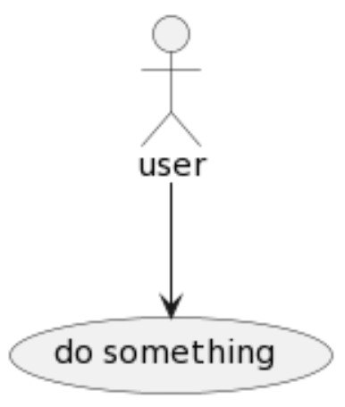
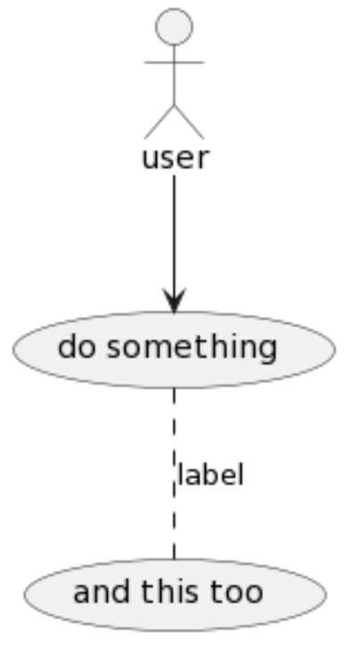

# Overview

In this activity you will be given a (somewhat) vague description of user requirements. From the description, you will extract the user goals and interactions by drawing a use case diagram. 

# PlantUML Cheat Sheet 

```
:User:
```


```
:User:
:Manager:
User  <|-- Manager
```


```
:user: --> (do something)
```



```
:user: --> (do something)
(do something) .. (and this too) : label 
```



```
:user: --> (do something)
note "note" as n1
(do something) .. n1
n1 .. (and this too) 
```


```
left to right direction

package system {
note "note" as n1
(do something) .. n1
n1 .. (and this too)  
(something else)
}

:user: --> (do something)
:user: --> (something else)
```


# Example 1

A computerized system to record sales and handle payments in a typical retail store. Hardware components include bar code scanner and computers. A system is to be built to increase checkout automation, fast and accurate sales analysis, and automatic inventory control. Actors to consider: **customer**, **cashier**, and **manager**. 

# Example 2

A system that allows users to register for workshops. Users need to check in every day when attending a workshop. If participants attend at least 50% of the workshop days, they receive a certificate that they can share on their social media platforms. Participants are invited to complete an evaluation form on the last day of a workshop. Administrator users create workshops, including defining their daily schedule. Administrators can issue workshop evaluation reports at any time. 

# Example 3

A system that allows companies to hire employees to fill vacancies. A job description can be created and a link must be provided for posting on platforms such as LinkedIn and similar. Candidates apply for a job by filling out a form and sending documents such as CVs and letters of recommendation, for example. A hiring committee evaluates all candidates for a position. The system should allow the hiring committee to discard candidates who do not meet the requirements. In these cases, an email should automatically be sent to the candidate saying that they are no longer being considered. The remaining candidates are interviewed and a decision is then made. Analytical reports can be obtained for any completed hiring process.