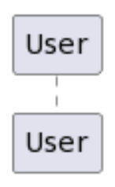
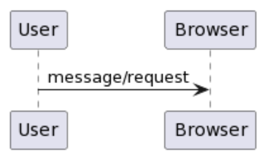
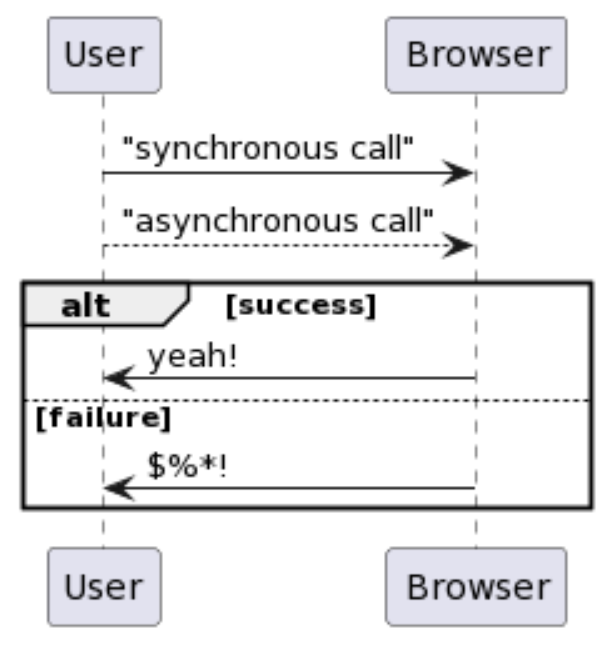
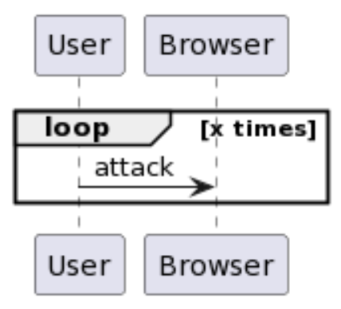

# Overview

In this activity you will be given a (somewhat) vague description of a use case. From the description, you will do your best to come up with sequence diagram that would capture the process described by the use case. 

# PlantUML Cheat Sheet 

```
participant User
```



```
participant User
participant Browser

User -> Browser: message/request
```



```
participant User
participant Browser

User -> Browser: "synchronous call"

User --> Browser: "asynchronous call"

alt success
  Browser -> User: yeah!
else failure
  Browser -> User: $%*!
end
```



```
participant User
participant Browser

loop x times
    User -> Browser: attack
end
```



```
participant User
participant Browser

User -> Browser: message/request

note right
Let's be clear about this message/request...
end note 
```

# Example 1

A user sends a request to the "flights API" using the entry point "/flights" with the following parameters: API access token, date of the flight, origin, and destination. If the access token is valid, the API server queries the database for the flights available that meet the criteria. A JSON response is then built by the API server and sent back to the user. In the case that the "access token" is invalid, a JSON response is built by the API server and sent back to the user with the reason why the request could not be fulfilled. Participants: user, "flights API", and database. Hint: API requests are asynchronous, while database requests are (typically) synchronous.  

# Example 2

A web app allows users to reserve room in a building. Authenticated users send their request to the web server with information such as the room number, the date of the reservation, starting and ending times. The web server then checks if the room is available by means of a query to the database. If the room is indeed available, the web server asks the user to confirm the reservation. Upon confirmation, the room is reserved. If the room is not available, the web server just informs the fact to the user. Participants: user, browser, web server, and database. 

