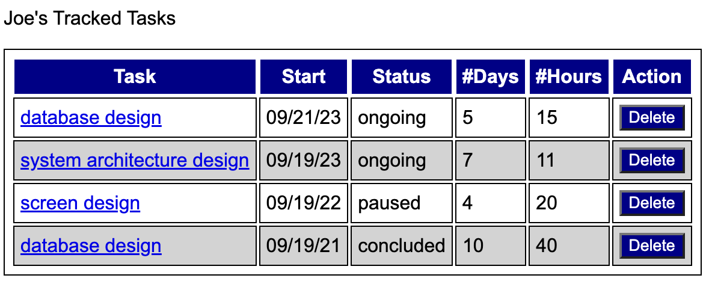
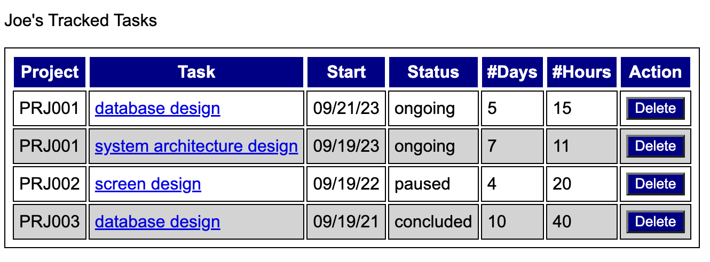
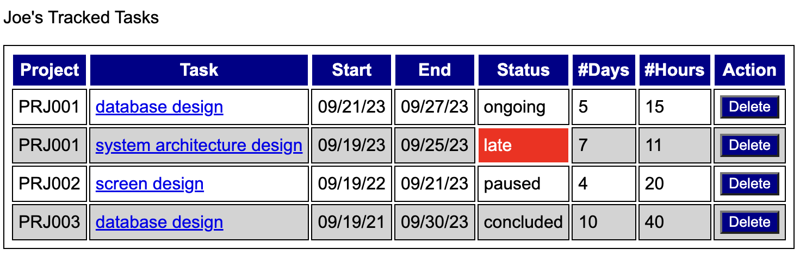
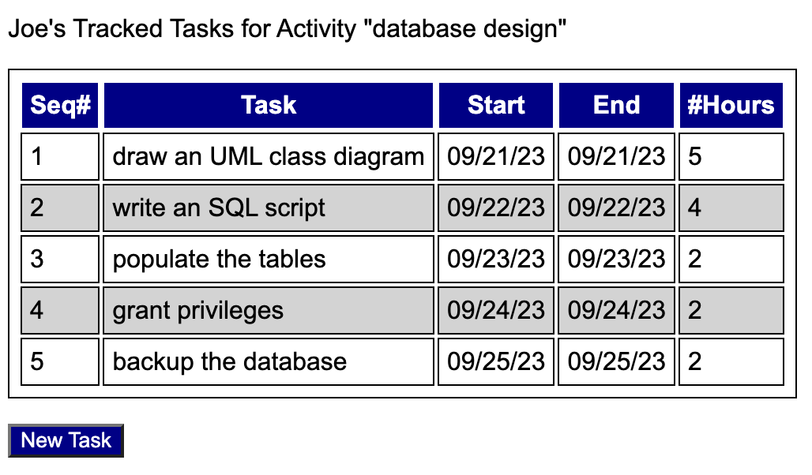
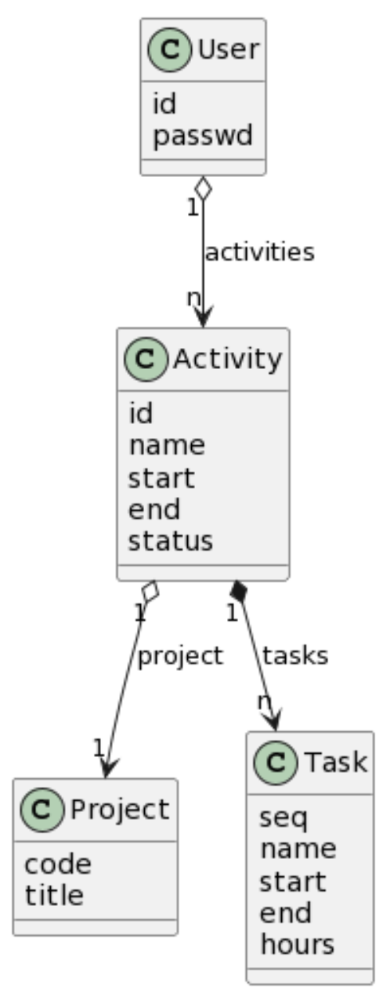

# Introduction

This activity aims to illustrate how the RUP process can be applied in the development of a system by detailing what is expected to be done, including artifacts to be produced, at the end of each phase of the unified process. This activity was inspired by the worker time tracking tool described in Chapter 4 of the RUP book. 

# Inception Phase

## Problem 

Organizations have difficulty gathering consistent data about time spent on various software development activities, compromising the ability to monitor a project's progress against estimates, pay collaborators, and do better estimates of effort in the future. 

## Vision 

A system that measures time spent on a task so management reports could be extracted later, making it easier the assessment of where effort is spent, compare actual and estimated effort to conclude a task, helping estimating future workloads. 

## Participants 

* Developers
* Project Managers

## Use Cases 

* measure time for an activity 
* extract weekly time sheets
* consolidate data for a project 

## Risk Assessment 

* developing team is still not very confident in using ORM (Object-relational Mapping) with SQLAlchemy
* members of the team might be exposed to covid

# Elaboration (v1)

A baseline architecture is built and discussed with stakeholders (people interested in this project). The baseline built will only care about the first use case: "measure time for an activity".  In real-world project, the baseline should focus on the most important (critical) use cases. 

A baseline uses "fake" (fabricated) data. For example: 

```
@app.route('/tasks')
def tasks():
    tasks = [
        { 
            'id': 123,
            'project_code': 'PRJ001', 
            'name': 'database design',
            'start': '09/21/23',
            'end': '09/27/23',
            'status': 'ongoing', 
            'days': 5, 
            'hours': 15 
        }, 
                { 
            'id': 234,
            'project_code': 'PRJ001', 
            'name': 'system architecture design',
            'start': '09/19/23',
            'end': '09/25/23',
            'status': 'late', 
            'days': 7, 
            'hours': 11 
        },
        { 
            'id': 345,
            'project_code': 'PRJ002', 
            'name': 'screen design',
            'start': '09/19/22',
            'end': '09/21/23',
            'status': 'paused', 
            'days': 4, 
            'hours': 20 
        },
                { 
            'id': 345,
            'project_code': 'PRJ003', 
            'name': 'database design',
            'start': '09/19/21',
            'end': '09/30/23',
            'status': 'concluded', 
            'days': 10, 
            'hours': 40 
        }
    ]
    user = {
        'tasks': tasks
    }
    return render_template('tasks.html', user=user)
```

The tasks tracked by collaborator named **Joe** were displayed like the following: 



Stakeholders noted that the screen didn't show the name of the project associated with each task. 

# Elaboration (v2)

A new baseline architecture is built and presented. 



Stakeholders noted that the tracking of a task should always be compared to its deadline. If a task is late, it should be displayed in bright red colors. 

# Elaboration (v3)

A new baseline architecture is built and presented. 



After this version, there was a discussion about terminology. It was agreed that the term **activity** would be more appropriate for a "group of related tasks to accomplish something".  Therefore, the fine-grain tracking of hours should be based on each individual **task** within the context of an **activity**. 

# Elaboration (v4)

A new baseline architecture is built and presented, this time also contemplating how tasks are displayed. 




# Elaboration (v5)

To mitigate the technological risk of developers not being very confident in using ORM with SQLAlchemy, the following data model was created and tested separately. 

```
class User {
  id
  passwd
}

class Project { 
  code
  title
}

class Activity { 
  id
  name
  start
  end
  status
}

Activity "1" o--> "1" Project: project

User "1" o--> "n" Activity: activities

class Task {
  seq
  name
  start 
  end 
  hours 
}

Activity "1" *--> "n" Task: tasks
```



ORM test can be found at [src/model_testing.py](src/model_testing.py). Not a rigorous test though (just a driver to visually check and assess the data model).

# Construction 

After 5 iterations of the elaboration phase, the developers felt good about moving forward. The iterations were key in finding the right design for this project. 

# Transition 

In the last phase a beta version is released. 