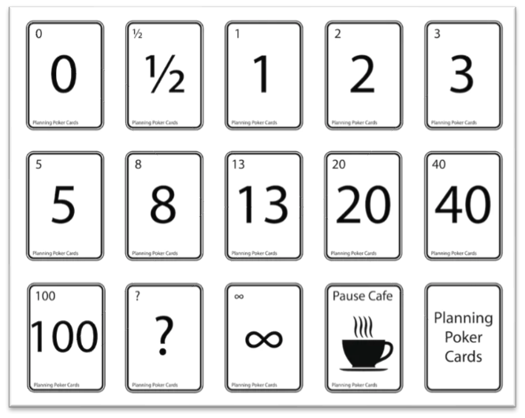

[](https://classroom.github.com/a/5xtPmGRK)
# Part 1

User Stories are informal descriptions of features of a system that are written from the perspective of the end user.  In part 1 of this activity you are given 3 (somewhat) vague description of user requirements. From those descriptions, write **user stories** with **acceptance criteria** using the following templates. 

```
As a [type of user], I want to [perform some task] so that I can [achieve some goal].

Given that [context], when [some action is carried out] then [a set of observable outcomes should occur].
```

## Example 1

A computerized system to record sales and handle payments in a typical retail store. Hardware components include bar code scanner and computers. A system is to be built to increase checkout automation, fast and accurate sales analysis, and automatic inventory control. Types of user to consider: customer, cashier, and manager. 

As a customer, I want to scan and buy my products at self-checkout so that I can save time.

Given that [context], when the customer scans their product and purchases the product then .

As a cashier, I want to scan products and process payment so that I can assist the customer with their transaction.

Given that [context], when the products are scanned and the payment is processed then the inventory will be updated and the sale will be recorded.

## Example 2

A system that allows users to register for workshops. Users need to check in every day when attending a workshop. If participants attend at least 50% of the workshop days, they receive a certificate that they can share on their social media platforms. Participants are invited to complete an evaluation form on the last day of a workshop. Administrator users create workshops, including defining their daily schedule. Administrators can issue workshop evaluation reports at any time.

## Example 3

A system that allows companies to hire employees to fill vacancies. A job description can be created and a link must be provided for posting on platforms such as LinkedIn and similar. Candidates apply for a job by filling out a form and sending documents such as CVs and letters of recommendation, for example. A hiring committee evaluates all candidates for a position. The system should allow the hiring committee to discard candidates who do not meet the requirements. In these cases, an email should automatically be sent to the candidate saying that they are no longer being considered. The remaining candidates are interviewed and a decision is then made. Analytical reports can be obtained for any completed hiring process.

# Part 2

For each user story below, estimate the amount of effort to implement them using the following system of points. 



## User Story #1

As a user, I want to be able to add new (cooking) recipes automatically by simply pasting the URL of recipes found online so that new recipes can be created quickly. Given that a recipe's URL is pasted, when the user clicks a button, all relevant information about the recipe (title, ingredients, and instructions) should be automatically pulled from the page associated with the URL and displayed to the user for further editing and confirmation.

## User Story #2

As a player, I want to be able to share my latest score on major social media platforms to impress my followers and friends. Given that the player has selected the game in which they have at least one recorded score, when the player clicks on the share icon they are automatically redirected to the corresponding social media platform with the latest score information ready to be posted.

## User Story #3

As an online shooper, I want to be able to search for products by description so I can select those that have good prices and reviews. Given that the online shopper has entered a description of what they want to buy, when clicking on the search button, a list of products that most closely match the description provided should be displayed; the online shooper can then select any of the displayed products if they wants get more information about the product (price, reviews, etc.).


