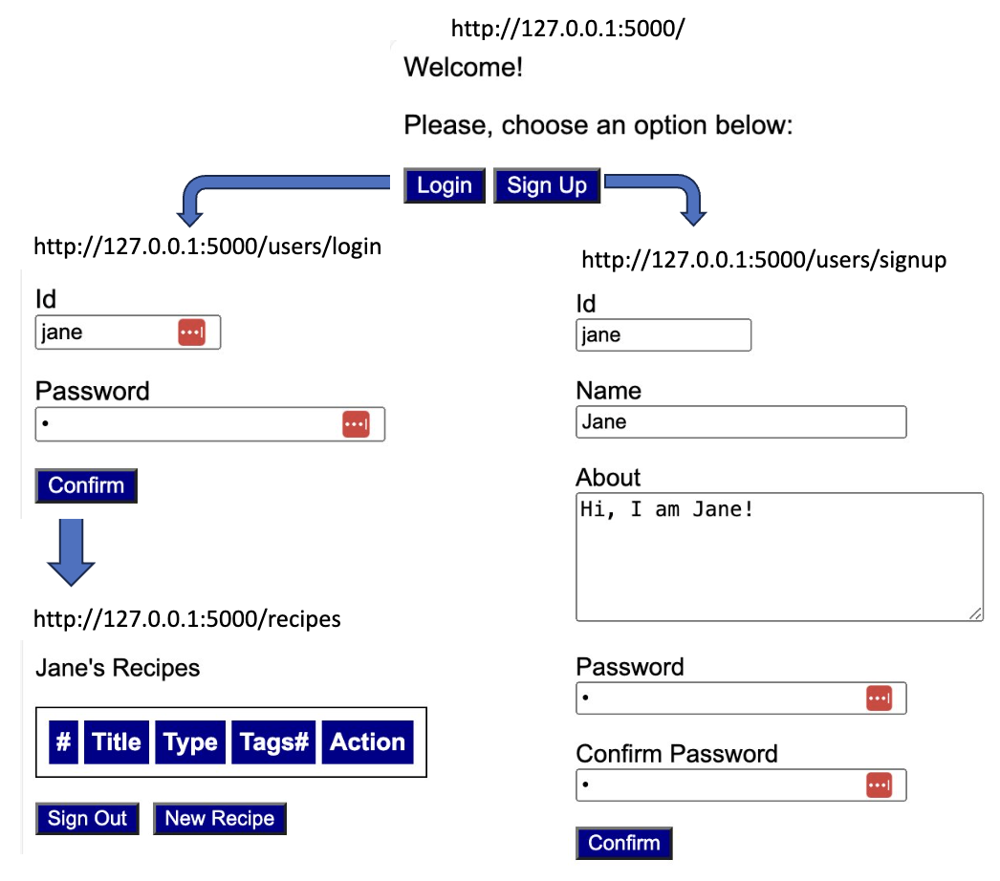
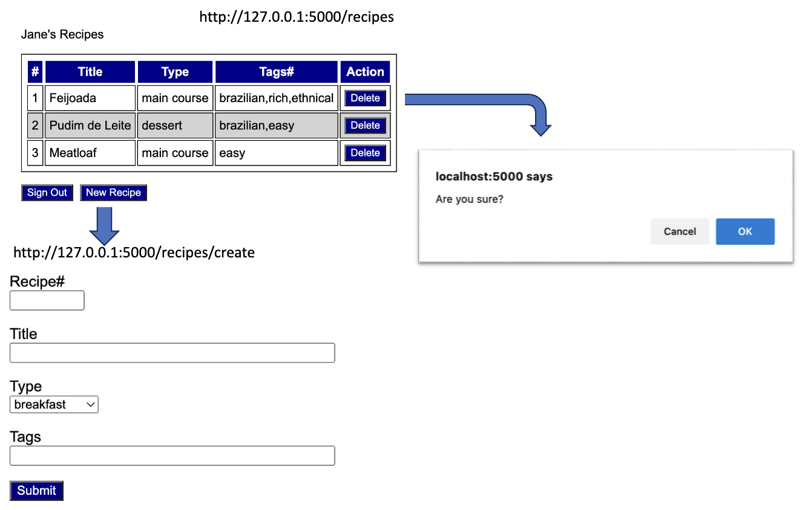

[](https://classroom.github.com/a/0QYjlVcV)
# Overview

This assignment is a combination of the previous homework assignments. Record that in the first homework you simply displayed recipes while in the second homework you learned how to incorporate user authentication using the **Flask-Login** package. This time you will be doing both as recipes are created and managed by individual users.  

# Goals

The web app you are asked to create is described below using screens and paths. 





An attempt to access any path beginning with "/recipes" without a user signed in should result in an authentication error. 

Most of the code required for this app is shared with you. You are asked to finish key parts of this web app to get it working.

# Setup

To simplify the process of installing all packages needed for this assignment, you can simply run: 

```
pip3 install -r requirements.txt
```
Don't forget to set a SECRET_KEY environment variable before attempting to run the app. 

# TO-DOs

## TO-DO #1 - Rendering of User's Recipes

User's recipes are displayed by **recipes.html**, a page that is rendered with the logged-in user. 

## TO-DO #2 - Create a Recipe 

**Flask-Login** maintains **current_user**: a reference to the logged-in user. **SQLAlchemy** does the "magic" of not only pulling out the user information from the database, but also all recipes associated with the user, as a list called **recipes**. To finish this to-do, you just need to create a new recipe, with the information gathered from the form, and append it to that list of recipes. Don't forget to call "commit" to persist the information into the database. 

# TO-DO #3 - Delete a Recipe

Create an **SQLAlchemy** query to get a reference of the recipe to be deleted. Then call "delete" (passing that reference) followed by "commit".

# Rubric 

This homework is worth 5 points distributed like the following: 

+1 TO-DO #1 

+2 TO-DO #2 

+2 TO-DO #3