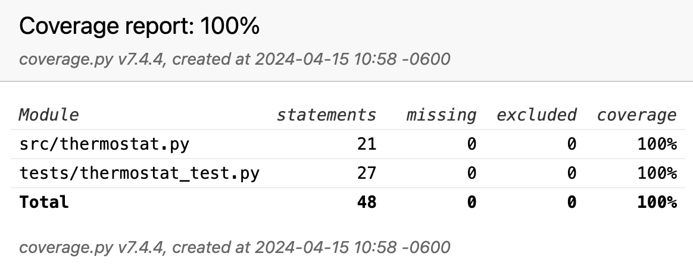

[](https://classroom.github.com/a/AL4IMCrO)
# Instructions 

Finish the TO-DOs in [ThermostatTestCase](tests/thermostat_test.py). You are NOT allowed to modify the given [Thermostat](str/thermostat.py) class. 

You are also required to complete the test coverage and generate the report in **html**. In summary, you need to generate and push the **htmlcov** folder with the report that should show a 100% coverage. 



# Rubric 

```
+1 for each to-do successfully completed
-1 no coverage report pushed showing 100% coverage
```